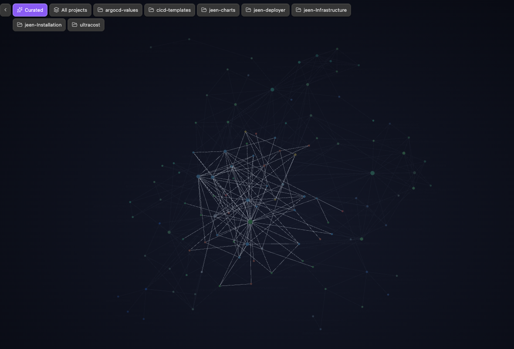

# Graph Project Buttons

One-click project filter buttons for the Obsidian graph view, so you never have
to type `path:` queries by hand.

The plugin injects a small button bar into every graph view: one button per
subfolder of a configurable root folder (default `projects`), plus a **Curated**
reset button and an **All projects** button. Click a button and the graph's
search is set for you.



## Features

- A button per immediate subfolder of your projects root, auto-discovered from
  the vault.
- A **Curated** button that applies a configurable reset query (default
  `-path:projects/`) and an **All projects** button (`path:<root>/`).
- Active-button highlighting that reflects the graph's current search.
- Collapsible bar (chevron toggle), per-button [lucide](https://lucide.dev)
  icons, and a left/right dock position.
- Re-injects itself when the graph re-renders, using a `MutationObserver` — no
  polling.
- The project list is cached and only recomputed when files are created,
  deleted, or renamed.
- Zero runtime dependencies. Desktop and mobile.

## Install

### Manually

1. Download `main.js`, `manifest.json`, and `styles.css` from the
   [latest release](https://github.com/danielkremen818/obsidian-graph-project-buttons/releases).
2. Copy them into your vault at
   `<vault>/.obsidian/plugins/graph-project-buttons/`.
3. Reload Obsidian (or toggle community plugins off and on) and enable
   **Graph Project Buttons** under **Settings → Community plugins**.

### From the community directory (once published)

Open **Settings → Community plugins → Browse**, search for
**Graph Project Buttons**, install, and enable it.

## Usage

Open any graph view. The bar appears in the top corner. Click a project button
to filter the graph to that subfolder, **Curated** to apply your reset query, or
the chevron to collapse the bar. The button matching the current search is
highlighted.

## Settings

| Setting | Default | Description |
|---|---|---|
| Projects root folder | `projects` | Top-level folder whose subfolders become buttons. |
| Curated query | `-path:projects/` | Graph search applied by the curated reset button. |
| Curated button label | `Curated` | Label shown on the curated reset button. |
| Show curated button | on | Show the curated reset button. |
| Show all-projects button | on | Show the **All projects** button. |
| Show icons | on | Show per-button lucide icons. |
| Bar position | Top left | Dock the bar to the top left or top right. |
| Start collapsed | off | Open the graph with only the toggle visible. |

## Development

```bash
npm install      # install dev dependencies (zero runtime deps)
npm run dev      # esbuild watch -> main.js
npm run build    # type-check (tsc --noEmit) + production bundle
npm test         # node:test unit tests for the pure helpers
npm run lint     # eslint (eslint-plugin-obsidianmd + typescript-eslint)
```

To develop against a real vault, symlink or copy this folder into
`<vault>/.obsidian/plugins/graph-project-buttons/` and run `npm run dev`.

See [docs/architecture.md](docs/architecture.md) for how the injection,
`MutationObserver`, and search dispatch fit together, and
[docs/publishing.md](docs/publishing.md) for the community-directory submission
steps. Repository conventions for contributors live in
[AGENTS.md](AGENTS.md) and [CONTRIBUTING.md](CONTRIBUTING.md).

## License

[MIT](LICENSE) © 2026 Daniel Kremen
