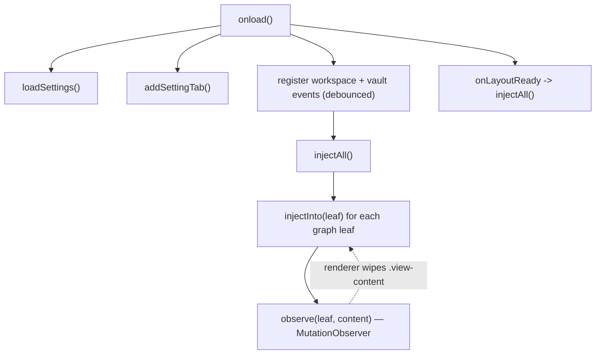

# Architecture

Graph Project Buttons is a single Obsidian `Plugin` that draws a filter bar into
each graph view and drives the graph's built-in search. The code splits into one
DOM/Obsidian-coupled module and one pure module:

```
src/main.ts      Plugin class — lifecycle, DOM injection, observers, search
src/settings.ts  settings interface, defaults, settings tab
src/projects.ts  pure helpers — project list, query building, no-op guard
```

`src/projects.ts` imports nothing from `obsidian`, so its logic is unit-tested
under plain Node (`npm test`). Everything that touches the DOM or the Obsidian
API lives in `src/main.ts`.

## Lifecycle



On load the plugin:

1. Loads settings (`Object.assign({}, DEFAULT_SETTINGS, await loadData())`).
2. Registers the settings tab.
3. Subscribes (via `registerEvent`, so Obsidian tears them down) to
   `workspace.layout-change` and `active-leaf-change` — both **debounced** — to
   re-inject the bar, and to `vault.create`/`delete`/`rename` — debounced — to
   invalidate the cached project list and re-inject.
4. On `onLayoutReady`, injects into any already-open graph views.

## Injection

`injectAll()` iterates `workspace.getLeavesOfType("graph")` and calls
`injectInto(leaf)` for each. `injectInto`:

- Finds the leaf's `.view-content` (`getContentEl`) and bails if a `.gpb-bar`
  already exists there (idempotent).
- Builds the bar with `createDiv`/`createEl`/`createSpan` (never `innerHTML`):
  a chevron toggle, then the **Curated** button, the **All projects** button,
  and one button per project from `getProjects()`.
- Each button stores its query in `dataset.query`, applies a lucide icon via
  `setIcon`, and on click calls `setSearch(leaf, query)` and updates the active
  highlight.
- Calls `markActive` to highlight the button matching the current search, and
  `observe` to start watching the content element.

`getProjects()` caches `computeProjects(vault.getFiles().map(f => f.path), root)`
and only recomputes after the cache is invalidated by a vault event or a
settings change.

## Re-injection without polling

The graph renderer periodically rebuilds `.view-content`, which removes the bar.
Instead of polling with `setInterval` (which Obsidian reviewers reject), each
content element gets a `MutationObserver` watching `childList`. When the bar
disappears, the observer disconnects itself, drops out of the `observers` map,
and re-injects. The observer is also registered for teardown via
`this.register(() => observer.disconnect())`.

## Driving the graph search

`searchInput(leaf)` locates the graph's search `<input>` (preferring
`.graph-controls .search-input-container input`). `setSearch` then:

```ts
if (shouldSkipSearchUpdate(input.value, query)) return; // no-op guard
input.value = query;
input.dispatchEvent(new Event("input", { bubbles: true }));
```

**The no-op guard is load-bearing.** Re-dispatching an `input` event when the
value already equals the query blanks the graph. `shouldSkipSearchUpdate`
(trimmed equality) prevents that, and the same comparison (`isActiveQuery`)
decides which button is highlighted.

## Cleanup

`onunload()` disconnects every observer, clears the map, and removes each
`.gpb-bar` — scoped per graph leaf (rather than the global `document`) so it also
covers leaves in popout windows.

## Why this shape

- **Pure core, thin shell.** The risky logic (path parsing, query building, the
  no-op guard) is pure and tested; the Obsidian glue is kept minimal.
- **Observer over polling.** Event-driven re-injection is cheaper and is the
  pattern Obsidian's guidelines expect.
- **Idempotent injection.** Every entry point re-checks for an existing bar, so
  overlapping events can't produce duplicates.
